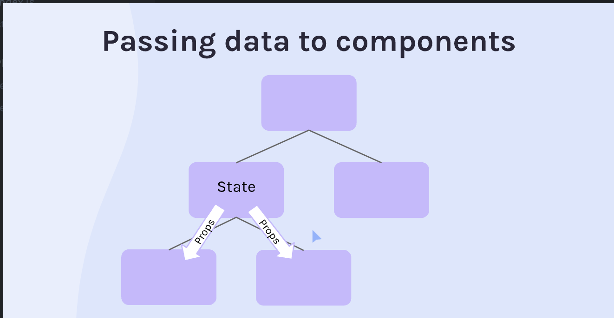

## My Notes

### In this projects: I built my second interactive REACT App.

### Key things learned/practiced:

1. Event listeners
2. State
3. Conditional rendering
4. Forms [inputboxes, checkbox, select, textarea]
5. Side Effects (API calls, etc)


/\*\*

- UPD:
- As soon as the Meme component loads the first time,
- make an API call to "https://api.imgflip.com/get_memes".
-
- When the data comes in, save just the memes array part
- of that data to the `allMemes` state
-
- Think about if there are any dependencies that, if they
- changed, you'd want to cause to re-run this function.
- \*/

### Notes

npm create vite@latest

1. Event listener
2. Ask API
3. Get random pic from what api gave us
4. display

React events:

https://legacy.reactjs.org/docs/events.html#mouse-events

1. When working with React, it's important to use state to update item and interface updates instead of just using `getElementById`. This is because React is declarative and state updates trigger re-renders of the component.

To update state in React, use the `useState` hook. This allows you to pass state setter functions down to child components, which is especially crucial in React.

```
const [show, setShow] = React.useState(false)
```

- Passing Data to Components:



2. When adding event listeners, it's important to add them to **native DOM elements** instead of custom elements. For example, if you have a custom `Star` component that you want to make clickable, you should add the `onClick` event to the `img` element inside the `Star` component.

   Here's an example:

   ````
   export default function Star(props) {
     const starIcon = props.isFilled ? starFilled : starNot

     return (
       
     )
   }
   ```
   ````

3. If you want to pass state to a sibling component, you should pass the state up to the parent component and then down to the child components. This is known as **"lifting state up"** in React.

### API Notes

1. When you put a fetch function in the top level of a React component, it can cause infinite re-rendering. To prevent this, you need to get the data and save it into state instead of calling the fetch function directly.

Here's an example:

```
fetch('https://swapi.dev/api/people/1')
  .then((res) => res.json())
  .then((data) => setStarWarsData(data))
```

2. React's primary tasks are to work with the DOM/browser to render UI to the page, manage state between render cycles (i.e state values are "remembered" from one render to the next), and keep the UI updated whenever state changes occur.

3. React can't handle outside effects on its own, such as localStorage, API/database interactions, subscriptions (eg web sockets), syncing two different internal states together, and basically anything that React isn't in charge of.

4. `useEffect` is a built-in hook in React that allows you to perform side effects in functional components. Side effects are operations that have an impact on the outside world, such as fetching data from an API, updating the browser's title or scrolling position, setting up event listeners, etc.

To prevent infinite rendering, `useEffect` takes two arguments: a function that contains the side effect code, and an optional array of dependencies that determine when the effect should be re-run. If the dependencies array is empty, the effect will only run once.

Here's an example:

```
useEffect(() => {
// side effect code goes here
}, [dependency1, dependency2, ...]);

```

In this example, the effect function will run whenever any of the dependencies in the array change. If the array is empty, the effect will only run once, on mount.

Here's an improved version of your README.md notes that is more structured and easier to read:

## Forms

1. Use the `onChange` event to listen to every keystroke in a form input field.

2. When the `onChange` event is triggered, the event is passed to the `handleChange` function, and `event.target` gives the element that made the event happen.

3. Use `event.target.value` to save the value of the element that triggered the changes.

4. To avoid using separate functions for each form input field, make the state as an object and use the `event` parameter in the `handleChange` function to determine which property of the state object to update.

   Here's an example:

```

const [formData, setFormData] = React.useState({
firstName: '',
lastName: '',
})

function handleChange(event) {
setFormData((prevFormData) => {
return { ...prevFormData, [event.target.name]: event.target.value }
})
}

```

### Forms: Controlled Components

1. In controlled components, there are two different states: one in the form input box in the regular HTML and the other updating in each stroke in our React code.

2. In controlled components, the state is in the driver's seat telling the input what to display, rather than the input box telling the state what to be.

### Forms: TextArea

Use the `textarea` tag to create a form field that allows for more text than a regular input field.

```

<textarea
  value={formData.comments}
  placeholder="Comments"
  onChange={handleChange}
  name="comments"
/>

```

### Forms: Checkbox

Use the `input` tag with `type='checkbox'` to create a checkbox.

```

<input
  type='checkbox'
  name='isFriendly'
  onChange={handleChange}
  checked={formData.isFriendly}
/>
<label htmlFor='isFriendly'>Is Friendly?</label>

```

### Forms: Radiobuttons

Give all options the same name so that only one option can be selected at a time. The `value` attribute should be unique.

```

<input
type='radio'
name='employment'
value='full-time'
onChange={handleChange}
checked={formData.employment === 'full-time'}
/>
<label htmlFor='full-time'>Full-time</label>

<input
type='radio'
name='employment'
value='part-time'
onChange={handleChange}
checked={formData.employment === 'part-time'}
/>
<label htmlFor='part-time'>Part-time</label>

```

### Forms: Select & Options

Use the `select` tag to create a dropdown menu, and the `option` tag to add options to the menu.

```

<select
id='favColor'
value={formData.favColor}
onChange={handleChange}
name='favColor'

>

  <option value='red'>Red</option>
  <option value='blue'>Blue</option>
  <option value='green'>Green</option>
</select>
```

Add an empty option to the menu with `value=''` and `-- Choose --` as the text to prompt the user to select an option.

```
<option value=''>-- Choose --</option>
```

### Forms: How to Submit a Form

1. Use a button inside the form to automatically act as a submit button. The default `type` of the button is `submit`.

2. Use the `onSubmit` event in the `form` tag to trigger the `handleSubmit` function when the form is submitted.

```
<form onSubmit={handleSubmit}>
```

3. Use `event.preventDefault()` in the `handleSubmit` function to prevent the default form submission behavior, which is to reload the page and reset the form values. Instead, use a function like `submitToApi` to handle the form submission.

```
function handleSubmit(event) {
  event.preventDefault()
  submitToApi(formData)
}
```

### Async in UseEffect

1. When using async operations inside of `useEffect`, you need to define the function separately inside of the callback function. This is because `useEffect` expects a cleanup function to be returned, not a promise.

Here's an example:

```

React.useEffect(() => {
async function getMemes() {
const res = await fetch("https://api.imgflip.com/get_memes")
const data = await res.json()
setAllMemes(data.data.memes)
}
getMemes()
}, [])

```

In this example, the `getMemes` function is defined separately inside the `useEffect` callback function, and is called to fetch data from an API. The `setAllMemes` function is then used to update the state with the fetched data.

```

```
